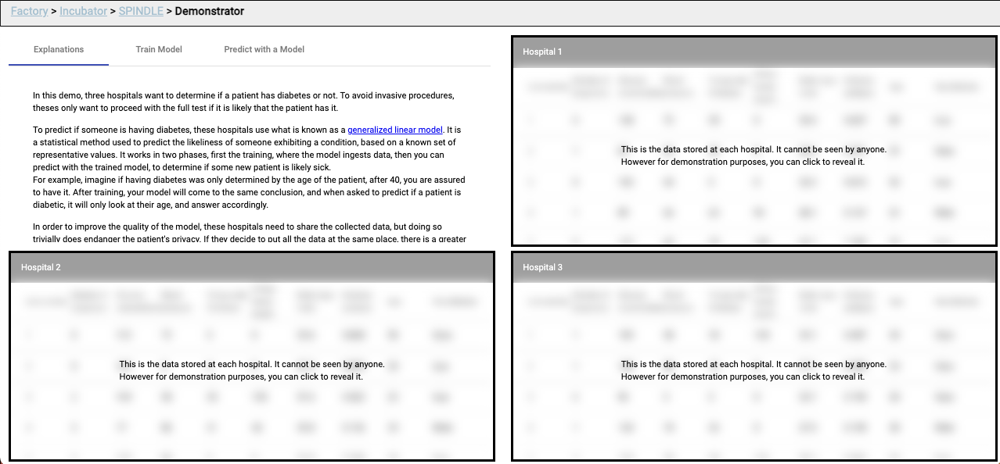
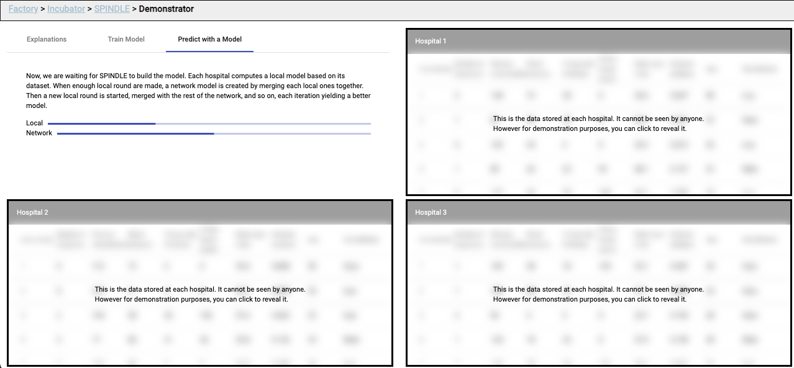
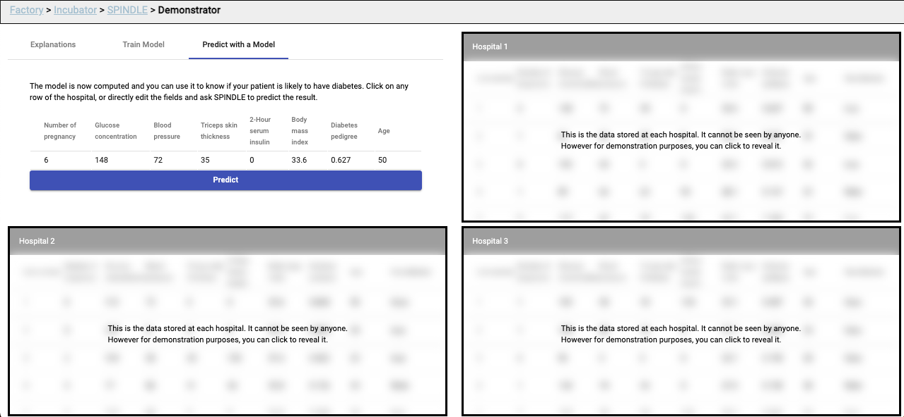

# Spindle demonstrator

Machine learning allows computers to make choices without being explicitly
programmed for each case. As this field is quite enormous, we will only talk
about
<a href="https://en.wikipedia.org/wiki/Supervised_learning">supervised learning</a>,
a special case of machine learning, which happens to be the one shown in
the demonstrator.

Supervised machine learning tries to match inputs to outputs, by finding links
between both. First, the program is given a list of known links, with that, it
creates what is called a "model" of the data, which can be used to determine
what would probably be the output based solely on the inputs.

## Demo

In the Spindle demo,
three hospitals want to determine if a patient has diabetes or
not. To avoid invasive procedures, theses only want to proceed with the full
test if it is likely that the patient has it.

To predict if someone is having diabetes, these hospitals use what is known as a
generalized linear model. It is a statistical method used to predict the
likeliness of someone exhibiting a condition, based on a known set of
representative values. It works in two phases, first the training, where the
model ingests data, then you can predict with the trained model, to determine if
some new patient is likely sick. For example, imagine if having diabetes was
only determined by the age of the patient, after 40, you are assured to have it.
After training, your model will come to the same conclusion, and when asked to
predict if a patient is diabetic, it will only look at their age, and answer
accordingly.

## How to run it

We're in the process of creating a docker image so that you can run the demo on your
own computer with a simple command:

```
docker-compose up
```

And then pointing your browser to the location http://localhost:8080

## Example





